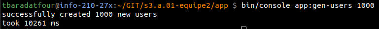
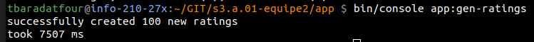

# DESCRIPTIF des commandes ajoutées par nos soins

## Généralités

- Toutes les commandes 'symfony' que nous avons écrites sont à effectuer depuis le dossier ``app`` du répertoire de projet
- Elles sont appellées via ``bin/console app:{nom_de_commande} {arguments éventuels}``
- Elles servent au remplissage d'une base de données de test / dev

## 1 : Génération d'utilisateurs

Cette première commande permet la génération d'utilisateurs aléatoires.

La commande est :  
``bin/console app:gen-users {nb}``    
où ``nb`` est l'argument permettant de préciser la quantité d'utilisateurs factices à générer. Cet argument n'est pas obligatoire, et en son absence, la commande génèrera 25 utilisateurs.

Un exemple d'utilisation serait le suivant : 

Et l'on y voit que générer un millier d'utilisateurs factices demande environ 10 secondes. Pour des raisons que nous n'avons pas eu le temps d'investiguer, générer dix milliers d'utilisateurs en un appel se révèle bien plus long que générer 10 fois un millier d'utilisateurs.

## 2 : Génération de ratings

Cette deuxième commande permet la génération de ratings aléatoires sur des séries aléatoires, par des users pris au hasard.

La commande est :
``bin/console app:gen-ratings {nb} {moy} {et}``
où ``nb`` a la même fonction que dans le commande précédente, ``moy`` et ``et`` représentent respectivement la moyenne et l'écart-type de la gaussienne utilisée pour la répartition des notes (en étoiles, donc, sur 5). Les valeurs par défaut sont 100, 2.5, et 0.75.

Exemple :

Il est à noter que la génération de ratings est plus lente que celle d'user, en majorité à cause du besoin de vérifier plus de choses

## 3 : Génération de vues

Cette dernière commande permet de prendre toutes les séries en base, et d'avoir de nombreux utilisateurs qui les marquent comme partiellement vues (partiellement pouvant être l'ensemble vide / la totalité de la série).

La commande est : 
``bin/console app:gen-views``
et ne prend pas de paramètre.

ATTENTION, cette commande peut être *extrêment longue* dès qu'il y a de nombreux utilisateurs générés par la commande 1 dans la base.

